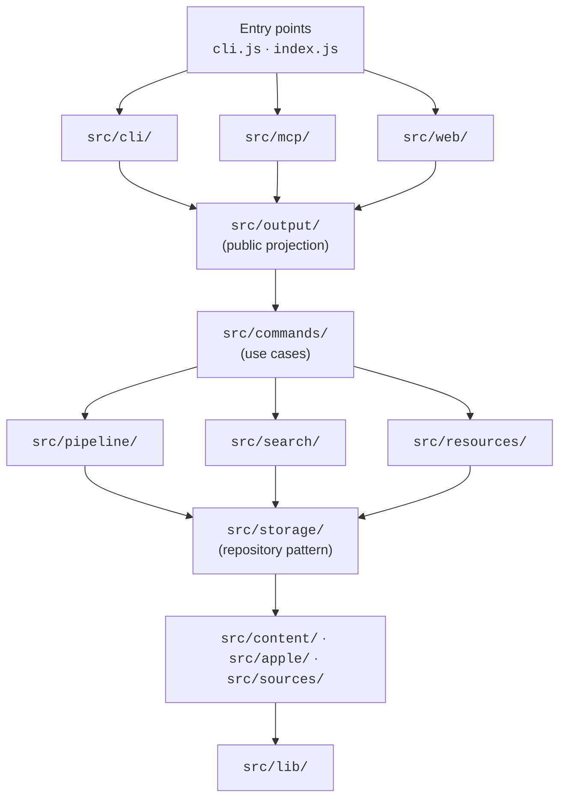

# Architecture

A short orientation for contributors. For day-to-day operator concerns
see [`docs/self-hosting.md`](docs/self-hosting.md); for the full
documentation index see [`docs/README.md`](docs/README.md).

## What apple-docs is

A Bun-only CLI, MCP server, and local website over a single SQLite
corpus of Apple developer documentation. Three public surfaces share
one application core, and one projection boundary keeps internal
infrastructure out of every public response.

## Five-layer stack



Invariants enforced by import discipline:

- No upward dependencies. `lib/` does not import from `commands/`;
  `commands/` does not import from `cli/`, `mcp/`, or `web/`.
- The three surfaces are parallel — they each depend on `commands/`
  and `output/`, not on each other.
- Every public payload routes through one of the `project*()` helpers
  in [`src/output/projection.js`](src/output/projection.js) before
  leaving the process.

## Key patterns

### Public projection boundary (`src/output/`)

`projection.js` is the single chokepoint for the public API. It defines
the allowlist for each surface response (`SearchHit`, `DocMetadata`,
`Framework`, `Taxonomy`, asset render outputs, status fields) and
strips everything else. `confidence.js` collapses the internal
`matchQuality` cascade into the public three-level
`'exact' | 'partial' | 'approximate'`. `schemas.js` declares the zod
schemas the MCP SDK validates `structuredContent` against.

`APPLE_DOCS_DEBUG=1` short-circuits both the projection allowlist and
the strict schemas — local-debug-only escape hatch. Leak-guard tests
under [`test/mcp/`](test/mcp/) and [`test/unit/`](test/unit/) walk
every surface response and fail if a field outside the allowlist
appears.

### Source adapter pattern (`src/sources/`)

Eleven `SourceAdapter` subclasses: `apple-docc`, `hig`, `guidelines`,
`swift-evolution`, `swift-book`, `swift-docc`, `swift-org`,
`apple-archive`, `wwdc`, `sample-code`, `packages`. Each adapter
implements:

```js
static type, static displayName, static syncMode
async discover(ctx)
async fetch(key, ctx)
async check(key, prevState, ctx)
normalize(key, payload)
extractReferences(key, payload)
renderHints()
```

[`src/sources/base.js`](src/sources/base.js) defines the contract and
the `validate*Result()` helpers every adapter calls before returning.
[`src/sources/registry.js`](src/sources/registry.js) maps source name
to class. Adding a new source means dropping in one adapter file and
adding one `registerAdapter(...)` line to the registry.

### Storage repository pattern (`src/storage/repos/`)

One repository per aggregate (documents, pages, roots, search, crawl,
operations, assets-fonts, assets-symbols). Each module exports a
`createXxxRepo(db, opts?)` factory that builds prepared statements
once at construction and returns a methods object. Methods are thin
wrappers; no raw DB rows leak past the repo boundary. Schema
migrations live under
[`src/storage/migrations/`](src/storage/migrations/) — append-only,
versioned `v1` upward.

The reader pool ([`src/storage/reader-pool.js`](src/storage/reader-pool.js))
runs SQLite reads on worker threads with classifier-based shard
selection so cheap reads do not queue behind deep body searches.

### Three surfaces, one application core

| Surface | Entry | Tool surface |
| --- | --- | --- |
| **CLI** | [`cli.js`](cli.js) | User-facing commands grouped Query / Setup & Sync / Hosting / Maintenance & Build. Advanced flags live under per-command "Advanced" subsections. `--json` routes through the public projection. |
| **MCP** | [`index.js`](index.js) → [`src/mcp/server.js`](src/mcp/server.js) | Eight tools (`search_docs`, `read_doc`, `browse`, `list_frameworks`, `list_taxonomy`, `search_sf_symbols`, `list_apple_fonts`, `render_sf_symbol`, `render_font_text`) and four resource templates. Stdio and Streamable HTTP transports. |
| **Web** | [`src/web/serve.js`](src/web/serve.js) | Static-site builder (`apple-docs web build`) and dev server (`web serve`). Twelve route files, content-hashed `/data/*` artifacts, SSR for `/docs/*`. |

All three flow through `src/commands/*.js` for use-case logic and
through [`src/output/projection.js`](src/output/projection.js) for
response shaping.

## Distribution

- **Source install:** `git clone … && bun install && bun link` (developer
  setup).
- **Snapshot install:** `apple-docs setup` (downloads a pre-built
  tarball with DB, raw JSON, Markdown, extracted Apple fonts, and the
  pre-rendered SF Symbols matrix).
- **Standalone binary:** `bun run build:cli` produces a single-file
  executable via `bun build --compile`. The `release-binaries.yml`
  workflow attaches `darwin-arm64`, `linux-x64`, and `linux-arm64`
  binaries to GitHub releases alongside the snapshot tarball.

## Observability

Optional Prometheus metrics on a dedicated port for both servers (web:
`--metrics-port 9101`, MCP: `--metrics-port`). Health and readiness
endpoints (`/healthz`, `/readyz`) on both. Structured JSON logs via
[`src/lib/logger.js`](src/lib/logger.js) with secret redaction and
per-request correlation IDs.

## Bun-native primitives

The codebase leans into Bun rather than Node compatibility:

- `bun:sqlite` for the corpus DB. The reader pool uses Bun's `Worker`.
- `Bun.serve()` for both HTTP servers; `Bun.spawn()` for archive and
  symbol-render subprocesses.
- `Bun.gzipSync`, `Bun.inflateSync`, `Bun.CryptoHasher`,
  `Bun.escapeHTML`, `Bun.sleep` instead of the `node:zlib`,
  `node:crypto`, and `setTimeout` idioms.
- `Bun.file()` and `Bun.write()` for reads and writes.

## What is intentionally out of scope

- A Node port — Bun is the only target runtime.
- A TypeScript compile step — JavaScript with JSDoc types validated
  by `bun x tsc --noEmit`.
- Background workers beyond the reader pool and the static-site build
  fan-out.
- External service dependencies at runtime. The corpus is local; the
  public hosted instance is the only optional network artefact.

## Documentation index

- [`README.md`](README.md) — usage, configuration, MCP setup.
- [`docs/self-hosting.md`](docs/self-hosting.md) — deployment topology.
- [`docs/perf/index.md`](docs/perf/index.md) — profiling workflow.
- [`docs/runbooks/`](docs/runbooks/) — operational runbooks.
- [`SECURITY.md`](SECURITY.md) — security policy and hardened defaults.
- [`ops/README.md`](ops/README.md) — reference self-hosted deployment.
