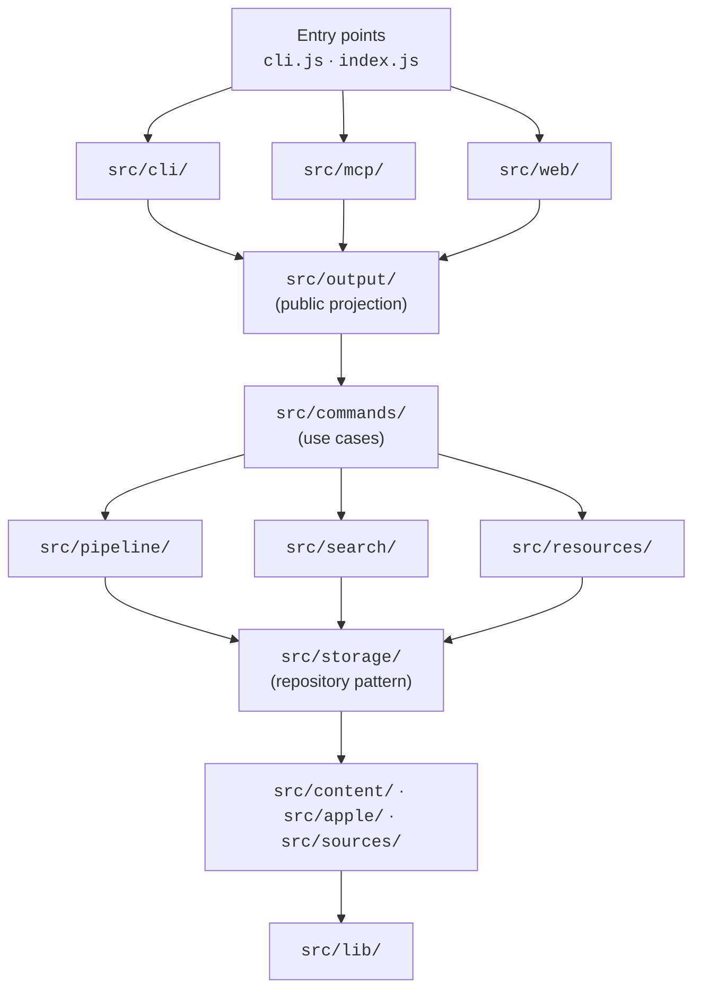
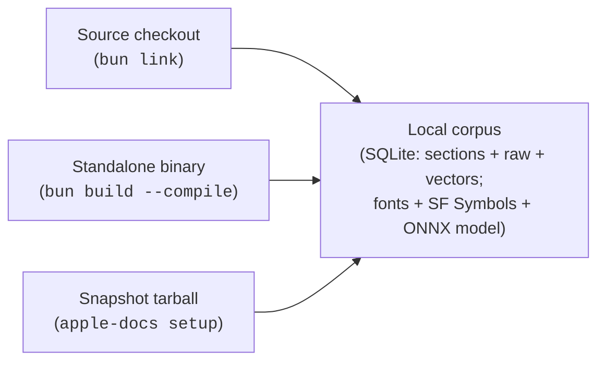

# Architecture

apple-docs is a Bun-only CLI, MCP server, and local website over a
single SQLite corpus of Apple developer documentation. Three public
surfaces share one application core, and one projection boundary keeps
internal infrastructure out of every public response.

## Five-layer stack



Invariants:

- No upward dependencies. `lib/` does not import from `commands/`;
  `commands/` does not import from `cli/`, `mcp/`, or `web/`.
- The three surfaces are parallel — they each depend on `commands/` and
  `output/`, not on each other.
- Every public payload routes through one of the `project*()` helpers in
  `src/output/projection.js` before leaving the process.

## Public projection boundary

`src/output/` is the single chokepoint for everything that leaves the
process as a public response.

- `projection.js` defines the allowlist for every surface response
  (`SearchHit`, `DocMetadata`, `Framework`, `Taxonomy`, render outputs,
  status fields) and strips everything else.
- `confidence.js` collapses the internal `matchQuality` cascade into the
  public three-level `'exact' | 'partial' | 'approximate'`.

MCP tools intentionally advertise **no `outputSchema`** — it tripled the
`tools/list` payload clients load into model context. The projection
allowlist plus the leak-guard suites are the output contract; a budget
test in `test/mcp/contract.test.js` keeps the whole tool surface under
10 KB.

`APPLE_DOCS_DEBUG=1` bypasses the projection allowlist for local
debugging only. Leak-guard tests under `test/mcp/`,
`test/unit/web/`, and `test/unit/cli/` walk every surface response and
fail if a field outside the allowlist appears.

## Source adapter pattern

`src/sources/` holds eleven `SourceAdapter` subclasses:
`apple-docc`, `hig`, `guidelines`, `swift-evolution`, `swift-book`,
`swift-docc`, `swift-org`, `apple-archive`, `wwdc`, `sample-code`,
`packages`. Each implements a uniform contract:

```js
static type
static displayName
static syncMode
async discover(ctx)
async fetch(key, ctx)
async check(key, prevState, ctx)
normalize(key, payload)
extractReferences(key, payload)
renderHints()
```

`src/sources/base.js` defines the contract and the `validate*Result()`
helpers every adapter calls before returning a structured value.
`src/sources/registry.js` maps source name to class. Adding a new source
means dropping in one adapter file and adding one `registerAdapter(...)`
line to the registry.

## Storage repository pattern

`src/storage/repos/` holds one repository per aggregate:

| Repo | Aggregate |
| --- | --- |
| `documents` | Normalized document rows |
| `pages` | DocC page rows (legacy aggregate retained for sync compatibility) |
| `roots` | Source-discovery roots |
| `search` | FTS + trigram + Levenshtein query glue |
| `crawl` | Per-key crawl state |
| `operations` | Long-running operation receipts |
| `assets-fonts` | Apple font catalog rows |
| `assets-symbols` | SF Symbols catalog rows |

Each module exports a `createXxxRepo(db, opts?)` factory that builds
prepared statements once at construction and returns a methods object.
No raw DB rows leak past the repo boundary.

Schema migrations live under `src/storage/migrations/` — append-only,
versioned `v1` upward. The reader pool (`src/storage/reader-pool.js`)
runs SQLite reads on worker threads with classifier-based shard
selection so cheap reads do not queue behind deep body searches.

## Three surfaces, one application core

| Surface | Entry | Tools / commands |
| --- | --- | --- |
| **CLI** | `cli.js` | User-facing commands grouped Query / Setup & Sync / Hosting / Maintenance & Build. Advanced flags live under a per-command "Advanced" subsection. `--json` routes through the public projection. |
| **MCP** | `index.js` → `src/mcp/server.js` | Nine tools (`search_docs`, `read_doc`, `browse`, `list_frameworks`, `list_taxonomy`, `search_sf_symbols`, `list_apple_fonts`, `render_sf_symbol`, `render_font_text`) and four resource templates. Stdio and Streamable HTTP transports. |
| **Web** | `src/web/serve.js` | Static-site builder (`apple-docs web build`) and dev server (`web serve`). Twelve route files, content-hashed `/data/*` artifacts, SSR for `/docs/*`. |

All three flow through `src/commands/*.js` for use-case logic and
through `src/output/projection.js` for response shaping.

## Distribution



- **Source install** populates the corpus by running `apple-docs sync`
  (full crawl) or `apple-docs setup` (snapshot).
- **Snapshot install** downloads a single pre-built `.tar.zst` that ships the
  DB (document sections + zstd-compressed raw payloads in `document_raw`),
  extracted Apple fonts, the pre-rendered SF Symbols matrix, and the offline
  embedding model. Semantic vectors are **not** shipped (the per-chunk codes
  are ~0.7 GB of incompressible blobs) — `setup` rebuilds `document_chunks` +
  `document_vectors` locally from the shipped sections + model in ~2 minutes.
  Markdown/HTML and loose raw-JSON are materialized on device
  (`storage materialize`), not shipped.
- **Standalone binary** compiles `cli.js` into a single executable via
  `bun build --compile`. The snapshot workflow (`snapshot.yml`) builds
  `darwin-arm64` and `linux-x64` binaries — commit-stamped via
  `--define` — and attaches them to the release alongside the snapshot
  tarball.

## Observability

- Prometheus metrics on dedicated ports for both servers
  (`--metrics-port`).
- `/healthz` and `/readyz` probes on both servers.
- Structured JSON logs via `src/lib/logger.js` with secret redaction
  and per-request correlation IDs.
- Starter Grafana dashboards under `ops/grafana/`. See
  [Grafana dashboards](/ops-grafana).

## Bun-native primitives

The codebase leans on Bun rather than Node compatibility:

- `bun:sqlite` for the corpus DB. The reader pool runs on Bun
  `Worker` instances.
- `Bun.serve()` for both HTTP servers. `Bun.spawn()` for archive
  extraction and symbol-render subprocesses.
- `Bun.gzipSync`, `Bun.CryptoHasher`, `Bun.escapeHTML`, `Bun.sleep`
  in place of the `node:zlib` / `node:crypto` / `setTimeout` idioms.
  (`Bun.inflateSync` is deliberately avoided in the symbol-PDF inflate
  path because Bun's implementation rejects Apple's DEFLATE streams;
  `node:zlib.inflateSync` is used there instead.)
- `Bun.file()` and `Bun.write()` for reads and writes.

## What is intentionally out of scope

- A Node port. Bun is the only target runtime.
- A TypeScript compile step. JavaScript with JSDoc types, validated by
  `bun x tsc --noEmit`.
- Background workers beyond the four already in use: the SQLite reader
  pool (`src/storage/reader-pool.js`), the static-site build fan-out
  (`src/web/build/worker-fanout.js`), the pyftsubset worker pool that
  backs `/api/fonts/subset`
  (`src/web/lib/font-subset/pyftsubset-pool.js`), and the long-lived
  Swift symbol-render subprocess used during sync
  (`src/resources/apple-symbols/sync.js`).
- External service dependencies at runtime. The corpus is local; the
  public hosted instance is the only optional network artefact.

## Continue reading

- [Installing](/installing) — three install paths and their verification.
- [Self-hosting](/self-hosting) — deployment topology and tuning.
- [Performance](/perf/) — profiling, benchmarks, and metrics scrape.
- [Security](/security) — vulnerability reporting and hardened defaults.
