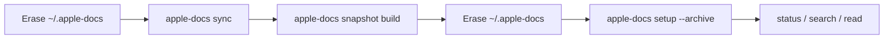

# End-to-end snapshot loop

The full operator loop, run locally: erase → sync → snapshot build →
erase → setup from the local archive → verify. Use this when you need
to confirm the operator loop closes on a clean machine without going
through a GitHub release.

## Commands

```bash
# 1. Erase the local data directory.
rm -rf ~/.apple-docs

# 2. Full sync against the live Apple API. Defaults: 100 in-flight
#    fetches and a 500 req/s rate limit.
#    APPLE_DOCS_DOWNLOAD_FONTS=1 so the snapshot ships the Apple typography
#    DMGs (the font index points at extracted files inside the snapshot).
APPLE_DOCS_DOWNLOAD_FONTS=1 apple-docs sync --verbose 2>&1 | tee /tmp/sync.log

# 3. Build the snapshot. --allow-incomplete-symbols covers the small
#    set of catalog-meta names that don't have a renderable vector
#    form (see "Known noise" below).
TAG="e2e-$(date -u +%Y%m%dT%H%M%SZ)"
apple-docs snapshot build --tag "$TAG" --allow-incomplete-symbols 2>&1 | tee /tmp/snapshot.log

# 4. Wipe again to simulate a fresh install host.
rm -rf ~/.apple-docs

# 5. Install from the local tarball. --archive lives under $HOME or cwd;
#    sibling .sha256 / .manifest.json are picked up by name convention.
apple-docs setup --archive "dist/apple-docs-full-${TAG}.tar.gz" 2>&1 | tee /tmp/setup.log

# 6. Verify.
apple-docs status --json | jq '{docs: .pages.active, capabilities, tier, failed: .crawlProgress.failed}'
apple-docs search 'NavigationStack' --limit 3
apple-docs read swiftui/view --max-chars 200
```

## Loop diagram



The bulk of the sync wall-clock is the per-page HEAD check during the
`update` phase and the Apple DocC framework crawl. The Swift symbol
prerender runs single-threaded by design.

## Known noise

### Catalog meta-names

A handful of names in the CoreGlyphs `symbol_search.plist` catalog do
not have a renderable vector form (the Swift `NSImage` handle accepts
the name but the prerender crashes during `-vectorGlyph drawInContext:`).
They are filtered at catalog ingest time, but if a new build surfaces a
similar pattern, `--allow-incomplete-symbols` lets the snapshot build
proceed and emits a count of the skipped entries.

### Apple API 403 / 404 during crawl

Apple's tutorials and data CDN returns 403 (gated) or 404 (missing) for
a small number of paths in a typical full crawl — for example
`.composer` accessors on a handful of foundation types, deeply-nested
`links` shapes under `enterpriseprogramapi`, certain
`webkit/wkwebview` overloads. These show up in the log at `debug` level
(`Failed: <path>`) and the `crawl_state` table records them with
`status='failed'`. The next sync retries them; if Apple still returns
403 or 404, the page never persists. This is normal.

## Sync interruption recovery

If a sync dies mid-way (network blip, OOM, user `Ctrl-C`), the next
`apple-docs sync` invocation resumes:

- `crawl_state.status='failed'` rows retry automatically.
- The `sync_checkpoint` row `body-index:incremental` records the last
  processed document id; the body index resumes from there.
- Already-rendered SF Symbol SVGs are detected on disk (`existsSync` +
  `size > 0`) and skipped.
- The pre-rendered SVG `meta.json` is rewritten if the renderer
  version changed since the last pass.

## Verify checklist

| Check | Pass criterion |
| --- | --- |
| `apple-docs status --json .capabilities` | `search`, `searchTrigram`, `searchBody`, `readContent` — all `true` |
| `apple-docs status --json .pages.active` | Within a few percent of the previous baseline on the same source corpus |
| `apple-docs search 'NavigationStack' --limit 3` | SwiftUI `navigationstack` in the top results |
| `apple-docs read swiftui/view` | Returns abstract and platforms list |
| `apple-docs status --json .crawlProgress.failed` | `0` after a clean install |
| `du -sh ~/.apple-docs` | Matches the manifest's `dbSize` plus raw JSON, Markdown, and resources |

## Snapshot artifact layout

`apple-docs snapshot build --tag <tag>` writes to `dist/`:

```text
dist/
├── apple-docs-full-<tag>.tar.gz         # corpus tarball
├── apple-docs-full-<tag>.sha256         # checksum of the tarball
└── apple-docs-full-<tag>.manifest.json  # metadata: schema, doc count, checksum
```

Example manifest (truncated):

```json
{
  "version": "<tag>",
  "schemaVersion": 18,
  "tier": "full",
  "createdAt": "<ISO 8601>",
  "documentCount": <count>,
  "dbChecksum": "<hex>",
  "dbSize": <bytes>,
  "archiveSize": <bytes>,
  "archiveChecksum": "<hex>"
}
```

`setup --archive <path>` discovers the sidecars by name convention:
`stripTarGz(path) + '.sha256'` and `stripTarGz(path) + '.manifest.json'`.
Missing sidecars produce a `warn` log and proceed; the local-archive
path treats checksums as an operator policy, not a correctness gate.

## Extracting the Swift symbol worker

If a future Bun or Swift upgrade breaks the symbol prerender at the
Swift compile step, extract the worker source and pipe it through
`swift -typecheck` (or `swiftc -parse`) to isolate the offending line:

```js
import { SYMBOL_WORKER_SCRIPT } from './src/resources/swift-templates.js'
process.stdout.write(SYMBOL_WORKER_SCRIPT)
```
