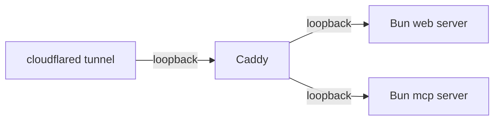

# Public-instance update runbook

Steps to roll a new snapshot to a self-hosted public instance after a
weekly (or manual) `snapshot.yml` GitHub Actions run.

This runbook assumes the standard `ops/` topology described in
[Self-hosting](/self-hosting):



It uses the `ops/bin/*.sh` shims so commands work under non-interactive
SSH without depending on the operator's PATH. Replace `<host>` with the
actual SSH target; replace `<repo>` with the repo checkout path declared
in your `ops/.env`.

## Pre-flight

1. Confirm the latest `snapshot.yml` workflow run succeeded — the
   determinism gate (re-build + sha256 diff) must be green. A failed
   determinism gate is a **do not deploy** signal; investigate first.
2. Note the snapshot tag (typically `snapshot-YYYYMMDD`) from the
   GitHub release page.

## Update

On the host that runs the public instance:

```bash
ssh <host>
cd <repo>

# Optional: render templates if .env changed.
ops/bin/render-all.sh

# Fetch the new snapshot tarball + .sha256 sidecar from GitHub releases.
ops/bin/pull-snapshot.sh --tag snapshot-YYYYMMDD

# Atomic deploy: drains the running web + MCP servers, swaps the
# corpus directory, restarts via launchctl.
ops/bin/deploy-update.sh

# Smoke-test the running instance.
ops/bin/smoke-test.sh
```

`deploy-update.sh` is idempotent and atomic — if any step fails, the
previous corpus stays in place and the running servers are not
interrupted.

## Verification

```bash
# Public liveness + readiness (replace with your hostname).
curl -sf https://<public-host>/healthz
curl -sf https://<public-host>/readyz

# Tool call via the MCP HTTP endpoint.
apple-docs mcp install --http https://<public-host>/mcp
# Use the printed config in Claude Code / Codex, then run a known query.

# Status freshness — should report the new snapshot tag. Uses the
# ops/bin/apple-docs shim so it works under non-interactive SSH.
ssh <host> '<repo>/ops/bin/apple-docs status --advanced --json' \
  | jq '.lastSync, .freshness'

# Internal probes (loopback, via the local Caddy + Bun chain).
ssh <host> "curl -sf http://127.0.0.1:\${APPLE_DOCS_PROXY_MCP_PORT:-3031}/readyz | jq"
```

## CDN cache warmup

After a corpus refresh, Cloudflare keeps stale objects for cached
`/api/*` and `/data/*` responses until they age out. Optionally trigger
a purge plus warmup:

```bash
ops/bin/cf-purge.sh --warmup
```

This issues a purge of `/api/*` and the static `/data/*` artefacts,
then re-fetches the most-used endpoints to populate the edge cache
from a known-warm state.

## Rollback

If `/readyz` or `ops/bin/smoke-test.sh` fails post-deploy:

```bash
ops/bin/deploy-update.sh --revert
```

Falls back to the previous snapshot directory (still on disk until
pruned).

## Related

- `snapshot.yml` workflow — produces the artefacts.
- `release-binaries.yml` workflow — attaches standalone CLI binaries.
- [Installing](/installing) — install paths (dev / standalone /
  production).
- [Self-hosting](/self-hosting) — full deployment reference (launchd,
  Caddy, cloudflared).
- [Security](/security) — snapshot validation and hardened defaults.
