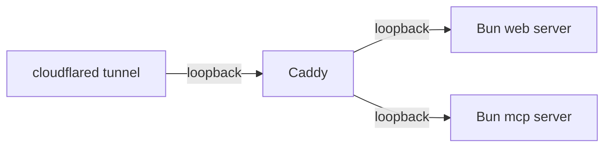

# Public-instance update runbook

Steps to roll a new snapshot to a self-hosted public instance after a
weekly (or manual) `snapshot.yml` GitHub Actions run.

This runbook assumes the standard `ops/` topology described in
[Self-hosting](/self-hosting):



It uses the `ops/bin/*.sh` shims so commands work under non-interactive
SSH without depending on the operator's PATH. Replace `<host>` with the
actual SSH target; replace `<repo>` with the repo checkout path declared
in your `ops/.env`.

## Pre-flight

1. Confirm the latest `snapshot.yml` workflow run succeeded — the
   determinism gate (re-build + sha256 diff) must be green. A failed
   determinism gate is a **do not deploy** signal; investigate first.
2. Note the snapshot tag (typically `snapshot-YYYYMMDD`) from the
   GitHub release page.

## Update

On the host that runs the public instance:

```bash
ssh <host>
cd <repo>

# Optional: render templates if .env changed.
ops/bin/render-all.sh

# Pull the latest GitHub release snapshot. The script auto-detects
# the newest published `snapshot-YYYYMMDD` tag, verifies its .sha256
# sidecar, and runs `apple-docs setup --force`. Use --force/-f or
# FORCE_PULL=1 to re-apply a tag that's already installed.
ops/bin/pull-snapshot.sh

# Atomic deploy: git pull, render templates, optional corpus refresh,
# incremental static-site rebuild, launchctl kickstart of web + MCP,
# Cloudflare edge purge, smoke test.
ops/bin/deploy-update.sh

# Smoke-test the running instance.
ops/bin/smoke-test.sh
```

`deploy-update.sh` keeps the previous web and MCP daemons online while
the corpus refresh runs, swaps in the new tree, then kickstarts the
services. Caddy's health-gated upstream absorbs the cut-over.

If you need to install a **specific** older snapshot tag (e.g. the one
you were on before today), download the asset by hand and feed it to
`setup --archive`:

```bash
gh release download <tag> --repo g-cqd/apple-docs \
  --pattern 'apple-docs-full-*.tar.gz' \
  --pattern 'apple-docs-full-*.tar.gz.sha256'
ops/bin/apple-docs setup --archive apple-docs-full-<tag>.tar.gz --force
ops/bin/deploy-update.sh
```

## Verification

```bash
# Public liveness + readiness (replace with your hostname).
curl -sf https://<public-host>/healthz
curl -sf https://<public-host>/readyz

# Tool call via the MCP HTTP endpoint.
apple-docs mcp install --http https://<public-host>/mcp
# Use the printed config in Claude Code / Codex, then run a known query.

# Status freshness — should report the new snapshot tag. Uses the
# ops/bin/apple-docs shim so it works under non-interactive SSH.
ssh <host> '<repo>/ops/bin/apple-docs status --advanced --json' \
  | jq '.lastSync, .freshness'

# Internal probes (loopback, via the local Caddy + Bun chain).
ssh <host> "curl -sf http://127.0.0.1:\${MCP_PORT:-3031}/readyz | jq"
```

## CDN cache purge

`deploy-update.sh` calls `ops/bin/cf-purge.sh` as its last step (no
flags). The script issues a single Cloudflare `purge_everything`
against the configured zone and returns. If `CLOUDFLARE_API_TOKEN` /
`CLOUDFLARE_ZONE_ID` aren't set in `ops/.env`, the purge step warns
and exits 0 — the deploy is still considered successful.

The site's Cache Rules already advertise `stale-while-updating`, so
end-users see the old cached object while Cloudflare revalidates
against the origin. There is no built-in warmup step. If you want to
pre-warm specific endpoints after a purge, drive `curl` against them
by hand:

```bash
for path in / /docs/swiftui/ /api/search?q=NavigationStack; do
  curl -sI "https://${PUBLIC_WEB_HOST}${path}" >/dev/null
done
```

## Rollback

There is no in-place revert. If `/readyz` or
`ops/bin/smoke-test.sh` fails after a deploy, recover by installing the
previous snapshot tag from scratch:

```bash
gh release download <previous-tag> --repo g-cqd/apple-docs \
  --pattern 'apple-docs-full-*.tar.gz' \
  --pattern 'apple-docs-full-*.tar.gz.sha256'
ops/bin/apple-docs setup --archive apple-docs-full-<previous-tag>.tar.gz --force
ops/bin/deploy-update.sh
ops/bin/smoke-test.sh
```

`apple-docs setup --force` wipes the `apple-docs.db` and extracts the
new archive into the same `DATA_DIR`. The reverse-proxy and tunnel
daemons stay up across the swap.

## Related

- `snapshot.yml` workflow — produces the artefacts.
- `release-binaries.yml` workflow — attaches standalone CLI binaries.
- [Installing](/installing) — install paths (dev / standalone /
  production).
- [Self-hosting](/self-hosting) — full deployment reference (launchd,
  Caddy, cloudflared).
- [Security](/security) — snapshot validation and hardened defaults.
