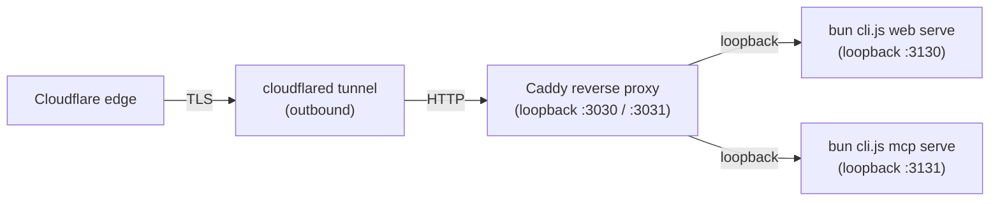

# Self-hosting

This guide covers running the apple-docs web UI and MCP server on your
own machine and, optionally, exposing them to the public internet.

If you only want to *use* the project's reference public MCP instance
from a client (Claude Code, Codex, Cursor, etc.), the
[Installing](/installing#configuring-an-mcp-client) page has client
configuration snippets. This document is for people who want to run the
services themselves.

The examples below come from the reference setup that runs the public
instance (Bun on macOS, behind Caddy, behind a Cloudflare tunnel).
Everything translates to Linux + systemd, a container runtime, or any
similar layout.

If you want a working starting point with all scripts already wired up,
see `ops/` in the repository — templated launchd plists, a Caddyfile,
cloudflared configs, and deploy scripts that render against an
operator-edited `.env`.

## Topology

The reference deployment separates four concerns:



- `cloudflared` terminates the public hostname and originates a local
  HTTP connection. No ports are opened on the host — the tunnel is
  outbound.
- **Caddy** owns stable local ports and proxies to the app. It lets you
  restart the Bun process without dropping tunnel traffic and provides
  a health-gated upstream.
- **Bun** runs `apple-docs web serve` and `apple-docs mcp serve` on
  private loopback ports. They have no built-in auth, no TLS, and are
  never reachable directly from the network.

You can collapse this (for example, skip Caddy and point the tunnel at
Bun directly). Caddy is in the reference because zero-downtime restarts
matter for a long-lived MCP endpoint.

## Pick a deployment shape

| Goal | What you need |
| --- | --- |
| **Local only, stdio MCP** | `apple-docs mcp start` and an MCP client config. No network setup. |
| **LAN-only, HTTP MCP for a homelab** | `apple-docs mcp serve --host 0.0.0.0` behind your LAN firewall. Optionally pin `--allow-origin`. |
| **Public-over-tunnel** | Cloudflare Tunnel (or Tailscale Funnel, ngrok, etc.) → optional reverse proxy → Bun on loopback. |
| **Public-with-real-TLS-cert** | A normal reverse proxy (Caddy, nginx, Traefik) with ACME against your hostname, loopback to Bun. |

**There is no built-in authentication.** Put access control at the edge
(Cloudflare Access, Tailscale ACLs, IP allowlist, mTLS — whatever you
already use). The MCP server trusts anything that reaches `/mcp`.

## Snapshot consumer requirements

`apple-docs setup` downloads a pre-built corpus snapshot. Every snapshot
ships the full corpus, every Apple font, and the entire pre-rendered SF
Symbols matrix
(`<dataDir>/resources/symbols/<scope>/<weight>-<scale>/<name>.svg`)
because the runtime cannot live-render those without the macOS SF
Symbols system bundle.

**SVG requests** (`/api/symbols/public/heart.svg?weight=bold&scale=large`)
are served straight from the pre-render — no host-side dependencies.

**PNG requests** (`/api/symbols/public/heart.png?...`) are derived at
request time from the same pre-rendered SVG via:

- `rsvg-convert` from librsvg, if available on `PATH`. On Debian or
  Ubuntu install with `apt install librsvg2-bin`; on Fedora or Arch use
  `dnf install librsvg2-tools` or `pacman -S librsvg`.
- macOS `/usr/bin/sips` as a fallback.

If neither rasterizer is available, PNG requests return 404 with a
clear error in the access log; SVG requests still work.

To verify your snapshot is self-sufficient (no live-render fallback),
set `APPLE_DOCS_SYMBOLS_OFFLINE=1` before starting `web serve`. Any
request that would have spawned the Swift / AppKit live renderer
returns 404 instead, so a misshipped snapshot fails loud during smoke
tests rather than serving a placeholder.

`apple-docs sync` on a host without the SF Symbols bundle produces an
empty `resources/symbols/` directory; the snapshot path is the
supported acquisition method on Linux and Windows hosts.

## Run the web server

```bash
apple-docs web serve \
  --port 3130 \
  --base-url https://apple-docs.example.com
```

- `--port` — bind port. Default `3000`.
- `--host` — bind address. Default `127.0.0.1`; pass `0.0.0.0` only when
  you intend to expose it on the LAN.
- `--base-url` — absolute URL used for canonical links and OpenGraph.
  Set it to whatever public hostname the user sees.
- `--rate-limit` — opt into the general per-client-IP token bucket. It
  is off by default; the narrower on-demand `/docs/*` upstream-fetch
  gate stays on.
- `--metrics-port` — optional Prometheus `/metrics` listener on a
  separate loopback port.
- `APPLE_DOCS_HOME` — path to the corpus. Default `~/.apple-docs`.
  Required for the server to find the SQLite DB and rendered artifacts.

The web server is stateless beyond the corpus, so multiple instances
can serve the same `APPLE_DOCS_HOME` read-only if you want horizontal
scaling.

## Run the MCP server

```bash
apple-docs mcp serve \
  --port 3131 \
  --host 127.0.0.1 \
  --allow-origin https://apple-docs-mcp.example.com
```

- `--port` — bind port. Default `3031`.
- `--host` — bind address. Default `127.0.0.1`. **Keep it on loopback
  unless you trust the network**; expose the server through a reverse
  proxy or tunnel.
- `--allow-origin` — comma-separated allowlist for the browser `Origin`
  header. When omitted, browser origins are denied except loopback
  origins. Native MCP clients that send no `Origin` header are allowed.
- `--concurrency` — max in-flight heavy tool calls
  (`search_docs`, `read_doc`, `browse`, SF Symbol rendering, font text
  rendering).
- `--queue` — max queued heavy calls before the server returns HTTP 503.
- `--metrics-port` — optional Prometheus `/metrics` listener on a
  separate loopback port.

Endpoints:

| Path | Method | Purpose |
| --- | --- | --- |
| `/mcp` | `POST` | JSON-RPC requests |
| `/mcp` | `GET` | Server-initiated SSE stream |
| `/mcp` | `DELETE` | Terminate a session |
| `/healthz` | `GET` | Liveness probe |
| `/readyz` | `GET` | DB and reader-pool readiness probe |

If `APPLE_DOCS_MCP_CACHE_STATS=1`, `/healthz` also reports per-tool
cache hit ratios and reader-pool depth — wire it into your probes.

## Reverse proxy (Caddy example)

Minimal Caddyfile that fronts the MCP server with a health-gated
upstream and keeps long-polled SSE alive:

```caddy
{
    admin 127.0.0.1:2019
    auto_https off
}

http://apple-docs-mcp.example.com:3031, http://127.0.0.1:3031 {
    bind 127.0.0.1

    reverse_proxy 127.0.0.1:3131 {
        header_up Accept-Encoding identity

        health_uri /healthz
        health_interval 10s
        health_timeout 5s
        health_passes 1
        health_fails 3
        fail_duration 5s
        max_fails 3

        # Keep long-polled SSE (GET /mcp) alive.
        stream_timeout 24h
        stream_close_delay 5m
    }
}
```

A matching `http://apple-docs.example.com:3030` block points at
`127.0.0.1:3130` for the web UI.

## Cloudflare tunnel example

One tunnel and one ingress rule per hostname.

`~/.cloudflared/config-mcp.yml`:

```yaml
tunnel: <your-mcp-tunnel-uuid>
credentials-file: /Users/you/.cloudflared/<your-mcp-tunnel-uuid>.json

ingress:
 - hostname: apple-docs-mcp.example.com
   service: http://127.0.0.1:3031     # Caddy port, or :3131 to skip Caddy
 - service: http_status:404
```

Run with:

```bash
cloudflared tunnel --config ~/.cloudflared/config-mcp.yml run apple-docs-mcp
```

The tunnel is outbound, so the host needs no inbound firewall rules.
`TUNNEL_ORIGIN_ENABLE_HTTP2=true` as an env var is worth setting for
MCP SSE streams.

If you do not want to use Cloudflare: Tailscale Funnel, ngrok, frp, or
a classic reverse-proxy-with-TLS all work the same way — point them at
the loopback port.

## Run as a background service (launchd example)

macOS LaunchDaemon that runs the MCP server with the reader pool
enabled:

```xml
<?xml version="1.0" encoding="UTF-8"?>
<!DOCTYPE plist PUBLIC "-//Apple//DTD PLIST 1.0//EN" "http://www.apple.com/DTDs/PropertyList-1.0.dtd">
<plist version="1.0">
<dict>
    <key>Label</key>
    <string>com.example.apple-docs.mcp</string>
    <key>ProgramArguments</key>
    <array>
        <string>/Users/you/.bun/bin/bun</string>
        <string>run</string>
        <string>/path/to/apple-docs/cli.js</string>
        <string>mcp</string>
        <string>serve</string>
        <string>--port</string>
        <string>3131</string>
        <string>--host</string>
        <string>127.0.0.1</string>
        <string>--allow-origin</string>
        <string>https://apple-docs-mcp.example.com</string>
    </array>
    <key>WorkingDirectory</key>
    <string>/path/to/apple-docs</string>
    <key>RunAtLoad</key><true/>
    <key>KeepAlive</key><true/>
    <key>ThrottleInterval</key><integer>10</integer>
    <key>ProcessType</key><string>Background</string>
    <key>EnvironmentVariables</key>
    <dict>
        <key>APPLE_DOCS_HOME</key>
        <string>/path/to/apple-docs-data</string>
        <key>APPLE_DOCS_MCP_CONCURRENCY</key>
        <string>8</string>
        <key>APPLE_DOCS_MCP_QUEUE</key>
        <string>64</string>
        <key>APPLE_DOCS_MCP_READERS</key>
        <string>on</string>
        <key>APPLE_DOCS_MCP_READER_WORKERS</key>
        <string>8</string>
        <key>APPLE_DOCS_MCP_CACHE_STATS</key>
        <string>1</string>
    </dict>
</dict>
</plist>
```

The reference deployment uses one plist per process — web server, MCP
server, Caddy, and one cloudflared tunnel per hostname — all following
the same shape. On Linux, translate directly to a systemd unit:
`ExecStart`, `Restart=always`, `Environment=` lines for each variable.

## Updating a running deployment

Two supported refresh paths:

1. **Snapshot refresh** — run `apple-docs setup --force` or
   `ops/bin/pull-snapshot.sh` to install the latest published snapshot,
   then rebuild the static site and restart web and MCP so caches pick
   up the new corpus.
2. **Crawl-on-host refresh** — run `apple-docs sync`, then rebuild the
   static site and restart web and MCP. `sync` is the single full-corpus
   pipeline: update checks, crawl, conversion, indexes, fonts, symbols,
   migrations, consolidation, and minification.

The `ops/bin/deploy-update.sh` script handles both modes. It keeps the
old web and MCP daemons online during the corpus refresh, rebuilds
`dist/web`, purges the Cloudflare edge cache when configured, then
performs a short cut-over restart and smoke test.

For atomic snapshot rollovers on a public instance, follow the
[Public-instance update runbook](/runbooks/public-instance-update).

## Observability

| Endpoint | What it shows |
| --- | --- |
| `GET /healthz` | Process liveness (`{status: "ok"}`) |
| `GET /readyz` | DB and reader-pool readiness |
| `GET /healthz` with `APPLE_DOCS_MCP_CACHE_STATS=1` | Also reports `cache` (hit ratios, per-tool sizes, stamp), `concurrency` (permits, waiters, rejects), and `readerPool` (size, active, pending, errors) |
| `GET /metrics` on `--metrics-port` | Prometheus metrics for web or MCP, bound to the separate metrics listener |

Example `/healthz` payload with stats enabled:

```json
{
  "status": "ok",
  "concurrency": {"heavyMax": 8, "heavyQueue": 64, "active": 0, "waiting": 0, "rejected": 0},
  "readerPool":  {"size": 8, "active": 8, "pending": 0, "spawns": 8, "errors": 0},
  "cache": {
    "enabled": true,
    "stamp": "8:1776563770798",
    "hitRatio": 0.5,
    "totalHits": 4,
    "totalMisses": 4,
    "tools": {"search_docs": {"hits": 4, "misses": 4, "size": 4}}
  }
}
```

Server-issued structured JSON logs go to stdout / stderr. Fields worth
alerting on: `level=error`, `prio=heavy` requests with `wait>0ms` (the
permit queue filled), and any `reader-worker[N] exited` lines (a
worker crashed and respawned).

Starter Grafana dashboards live under `ops/grafana/`; see
[Grafana dashboards](/ops-grafana).

## Environment variables

### Corpus and CLI

| Variable | Default | Purpose |
| --- | --- | --- |
| `APPLE_DOCS_HOME` | `~/.apple-docs` | Corpus location (SQLite DB + rendered artifacts) |
| `APPLE_DOCS_RATE` | `500` for `sync`, `5` otherwise | Default request rate against Apple endpoints |
| `APPLE_DOCS_BURST` | At least the active rate | Rate-limiter burst size |
| `APPLE_DOCS_CONCURRENCY` | `100` for `sync`, `5` otherwise | Max simultaneous outbound HTTP fetches |
| `APPLE_DOCS_PARALLEL` | `10` | Number of DocC roots crawled in parallel during `sync` |
| `APPLE_DOCS_TIMEOUT` | `30000` | HTTP timeout in ms |
| `APPLE_DOCS_GITHUB_TIMEOUT` | `45000` or `APPLE_DOCS_TIMEOUT` | GitHub-specific timeout override |
| `APPLE_DOCS_API_BASE` | Apple tutorial data URL | Override Apple's DocC API base |
| `APPLE_DOCS_LOG_LEVEL` | `info` | `debug` / `info` / `warn` / `error` |
| `APPLE_DOCS_SKIP_RESOURCES` | unset | Set to `1` to skip font and SF Symbols sync during `sync` |
| `APPLE_DOCS_DOWNLOAD_FONTS` | unset | Set to `1` to download and extract Apple font DMGs during `sync` |
| `GITHUB_TOKEN` / `GH_TOKEN` | unset | Required only when `APPLE_DOCS_PACKAGES_FETCH=api` |
| `APPLE_DOCS_PACKAGES_SCOPE` | `official` | `official` (curated) or `full` (Swift Package Index catalog) |
| `APPLE_DOCS_PACKAGES_FETCH` | `raw` | `raw` = README-only via `raw.githubusercontent.com`. `api` = GitHub REST with token (adds stars, license, topics). Degrades to `raw` if no token. |
| `APPLE_DOCS_PACKAGES_LIMIT` | unset | Cap total packages fetched in `full` scope |

### Web server

| Variable | Default | Purpose |
| --- | --- | --- |
| `APPLE_DOCS_WEB_HOST` | `127.0.0.1` | Default bind host for `web serve` |
| `APPLE_DOCS_WEB_RATE_LIMIT` | unset | Set to `1` to enable the general web rate limiter |
| `APPLE_DOCS_WEB_RATE` | `60` | Web rate-limiter rate when enabled |
| `APPLE_DOCS_WEB_BURST` | `120` | Web rate-limiter burst when enabled |
| `APPLE_DOCS_SYMBOLS_OFFLINE` | unset | Set to `1` to require pre-rendered SF Symbol assets and fail missing live renders loudly |

### MCP HTTP server

| Variable | Default | Purpose |
| --- | --- | --- |
| `APPLE_DOCS_MCP_CONCURRENCY` | `8` | Max in-flight heavy tool calls. Keeps initialize / ping / tools-list responsive under load. |
| `APPLE_DOCS_MCP_QUEUE` | `64` | Max queued heavy calls beyond concurrency before rejecting with HTTP 503. `0` = reject immediately once permits are exhausted. |
| `APPLE_DOCS_MCP_READERS` | unset (off) | Set to `on` to enable the worker-thread reader pool. Heavy read-only SQL runs on dedicated threads with their own `bun:sqlite` handle, off the main event loop. |
| `APPLE_DOCS_MCP_READER_WORKERS` | auto (`availableParallelism() − 2`, capped at 12) | Explicit worker count when the pool is on. Match it to `APPLE_DOCS_MCP_CONCURRENCY` so a saturating burst fits. |
| `APPLE_DOCS_MCP_CACHE` | unset (on) | Set to `off` to disable the response cache (debugging only). |
| `APPLE_DOCS_MCP_CACHE_SCALE` | `1` | Uniform multiplier on every default cache capacity. `1` keeps the laptop-sized defaults; values above `1` raise the cache budget for dedicated servers. Fractional values accepted. |
| `APPLE_DOCS_MCP_CACHE_STATS` | unset | Set to `1` to surface cache + concurrency + reader-pool stats on `/healthz`. |

CLI flags (`--port`, `--host`, `--allow-origin`, `--concurrency`,
`--queue`) take precedence over the corresponding environment
variables.

## Tuning and hardening

- **The reader pool is the single biggest lever** for concurrent-request
  latency. With `APPLE_DOCS_MCP_READERS=on` and workers sized to match
  the concurrency ceiling, `/healthz` stays responsive even during a
  saturating burst of heavy tool calls — the event loop stays free.
- **Match concurrency to workers.** If permits > workers, the surplus
  queues on the pool. If workers > permits, surplus workers sit idle.
  `8/8` is a reasonable default for modern hardware.
- **Set `APPLE_DOCS_HOME` read-only** for MCP and web processes that
  never write, if your OS supports it. Corpus writers
  (`apple-docs setup`, `apple-docs sync`, `apple-docs consolidate`,
  `apple-docs index rebuild`, and `apple-docs storage gc`) need write
  access — run them from a separate identity or an admin shell.
- **Cache stamp rotates on writer completion.** If you see `totalHits`
  drop to zero after a deploy, that is expected — the stamp changed,
  invalidating all entries. It re-warms after a few client calls.
- **Single-machine beats distributed.** The design assumes one writer
  and many readers on shared storage. For redundancy, run multiple
  MCP / web processes against the same `APPLE_DOCS_HOME` and
  load-balance them; do not try to run parallel writers.
- **Watch the err log after a daemon restart.** `reader-pool: ready
  size=N` should be the first line. If you see `reader-worker[N] exited
  with code ...`, the worker crashed — the pool respawns lazily on next
  dispatch, but a tight crash loop indicates a schema mismatch or an
  mmap problem and should be investigated.
